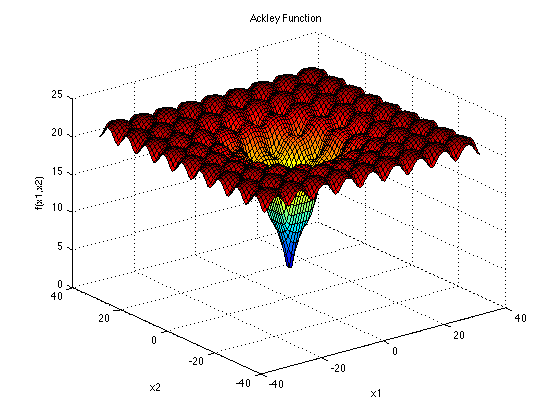
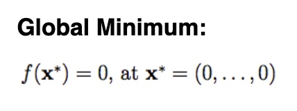
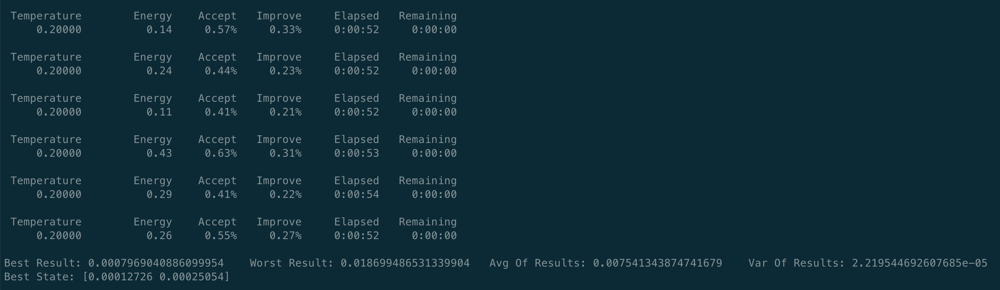
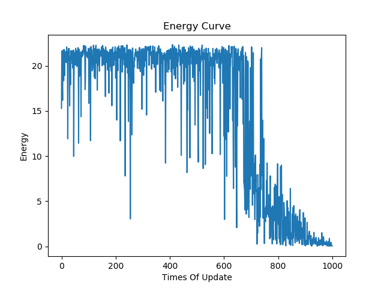

# UsingSimulatedAnnealingAlgorithmToSolveFunctionOptimizationProblem

## 实验内容

在本次实验中，我们将使用模拟退火算法进行多极小值函数的求解。

我们选择的函数为[Ackley函数](http://www.sfu.ca/~ssurjano/ackley.html)，其函数图像大致如下图所示：

函数解析式为：

根据官方文档的建议，我们选择$a=20$，$b=0.2$，$c=2\pi$，$d=2$。

函数的最小值为：

我们限制自变量的取值范围为[-40，40]。初始状态是通过均匀分布随机产生的，而状态的转移则是通过标准正态分布产生的，学习的步长设为1。

模拟退火算法的实现参考了GitHub上的代码——[https://github.com/perrygeo/simanneal](https://github.com/perrygeo/simanneal)。

## 实验结果

在对初始温度、终止温度、迭代次数等超参数进行了一定的调整后，我们进行了20次随机实验，得到统计结果如下图所示:

可以看到，平均性能为0.0075，最佳性能为0.0008，对应的最优解为(0.00013,0.00025)，最差性能为0.0187，方差为0.00002。

其中较为典型的目标函数变化曲线为：

## 实验分析

从20次随机实验得到的统计结果来看，模拟退火算法在迭代足够多次数之后，基本上都能达到全局最小值，即原点，说明在性能上，模拟退火算法是很强的。

与此同时，从目标函数的变化曲线上看，曲线的波动程度逐渐减小，这与模拟退火算法的温度逐渐下降是符合的。

此外，模拟退火算法的性能与超参数的选择也有比较大的关系，需要根据结果调整超参数，最后才能得到比较让人满意的结果。